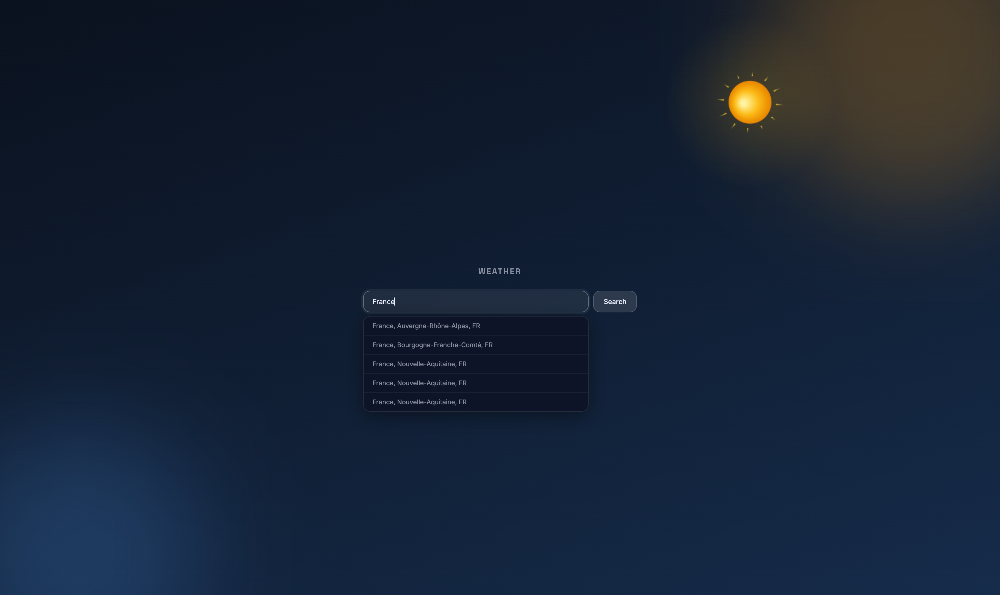
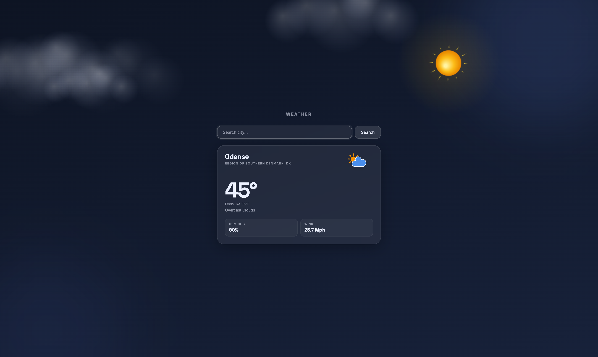
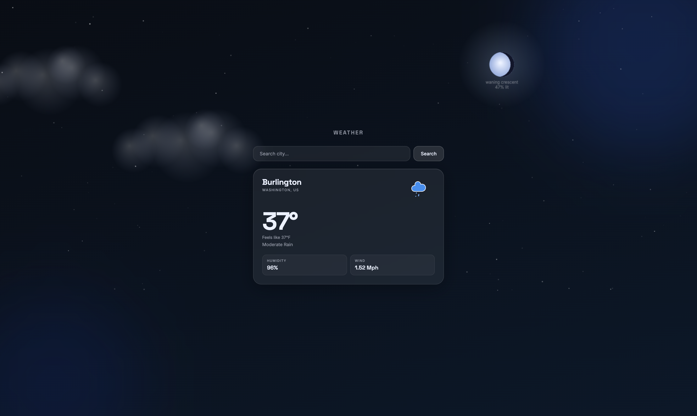

# Weather App

## Overview

A simple Flask web app that shows current weather for a city (or for your current location) using the OpenWeather APIs. It includes city autocomplete suggestions, condition-based styling, and extra sky details like moon phase/illumination.





## Features

- **Search by city name** (server-side fetch via OpenWeather geocoding + current weather)
- **Autocomplete city suggestions** (typeahead after 3+ characters)
- **Condition-aware UI** (maps OpenWeather condition codes to icons/styles)
- **Moon phase + illumination** (computed locally)

## Tech Stack

- **Backend**: Python, Flask
- **Frontend**: HTML templates (Jinja), vanilla JS, CSS
- **APIs**: OpenWeather Geocoding + Current Weather
- **Tests**: pytest
- **CI**: GitHub Actions

## Project Structure

```text
weather-app/
  app/
    __init__.py          # Flask app factory
    routes.py            # Web routes (/ , /weather, /suggest, /weather-by-coords)
    weather.py           # OpenWeather API calls + response shaping
    utils.py             # icon/condition helpers + moon calculations
    static/              # JS/CSS/assets
    templates/           # Jinja templates
  tests/
    test_routes.py
  run.py                 # Local dev entrypoint
  requirements.txt
```

## Getting Started

### Prerequisites

- **Python**: 3.13 (matches CI)
- An **OpenWeather API key**

### Install

```bash
python -m venv .venv
source .venv/bin/activate
pip install -r requirements.txt
```

### Configure environment variables

This app expects:

- **`OPENWEATHER_API_KEY`**: your OpenWeather API key

Create a `.env` file in the repo root:

```bash
OPENWEATHER_API_KEY=your_key_here
```

(`python-dotenv` is used, so the app will load `.env` automatically.)

### Run the app (development)

```bash
python run.py
```

Then open `http://127.0.0.1:5000`.

### Routes (quick reference)

- **`GET /`**: main page
- **`POST /weather`**: form post with `city`
- **`GET /suggest?q=...`**: JSON suggestions (returns empty list when query length < 3)
- **`POST /weather-by-coords`**: form post with `lat`, `lon`, optional `state`

## Running Tests

```bash
pytest -v
```

## CI/CD

GitHub Actions runs tests on pushes/PRs to `main` using **Python 3.13** and expects `OPENWEATHER_API_KEY` to be configured as a repository secret.

## Deployment

This repo currently runs the app via `python run.py` (Flask dev server).